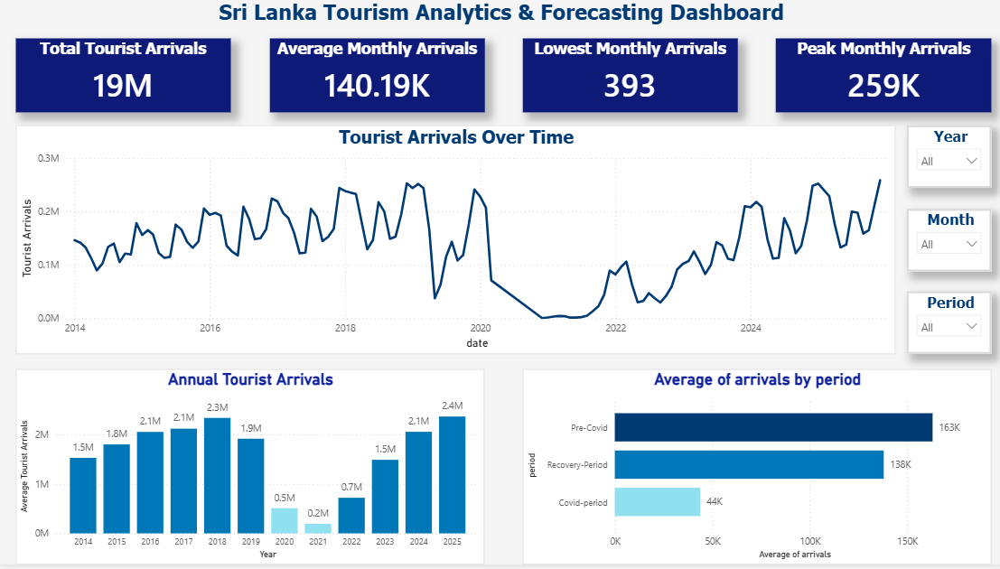
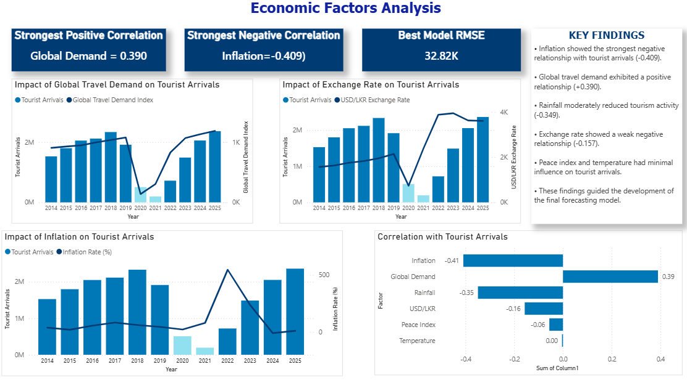
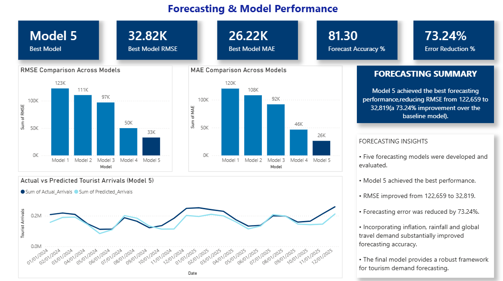

# Sri Lanka Tourism Analytics and Forecasting

## Project Overview

This project analyzes Sri Lanka tourism arrivals from 2014 to 2025 using economic, environmental and global tourism indicators.

The project includes:

- Data Cleaning
- Exploratory Data Analysis
- Correlation Analysis
- Forecasting using Prophet
- Power BI Dashboard Development

---

## Tools Used

- Python
- Pandas
- NumPy
- Matplotlib
- Seaborn
- Prophet
- Power BI

---

## Key Results

- Forecast Accuracy: 81.30%
- RMSE Reduction: 73.24%
- Best Model: Prophet with External Regressors

---

## Dashboard Pages

### Page 1 - Tourism Overview

### Page 2 - Economic Factors Analysis

### Page 3 - Forecasting & Model Performance

---

## Author

Yasas Wijerathne